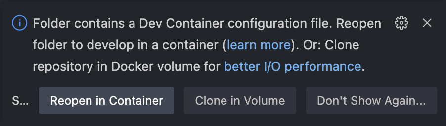

# ML devcontainer

A simple development container for machine learning with:
- zsh + oh-my-zsh + p10k
- mamba

A bunch of python modules are pre-installed in the `dev` environment (see the
list in `environment.yml` and/or `conda-lock.yml`)

## How to update the python modules 🔄

Python dependencies are specified using `environment.yml`, then we use `conda-lock` to
resolve the dependencies for several platforms.

To update the dependencies:
```
conda-lock -f environment.yml
```

Test a bit using 1 of the options below about [How to use](#how-to-use)

Then you can commit the new `conda-lock.yml` file.

## How to use 🚀

### Launch a devcontainer - local dev 🙂

When opening the folder with VSCode, it will ask you if you'd like to reopen the folder
in a devcontainer:



### Launch a devpod - cloud dev 🤩

Use [devpod](devpod.sh) to launch a VM with a devcontainer. See their documentation for
for more information.

### Launch the docker image locally - debug 🧐

Build the docker image:
```
docker build -t TAG_OF_YOUR_DOCKER_IMAGE .devcontainer/Dockerfile .
```

Interactive test
```
docker run -it TAG_OF_YOUR_DOCKER_IMAGE
```
